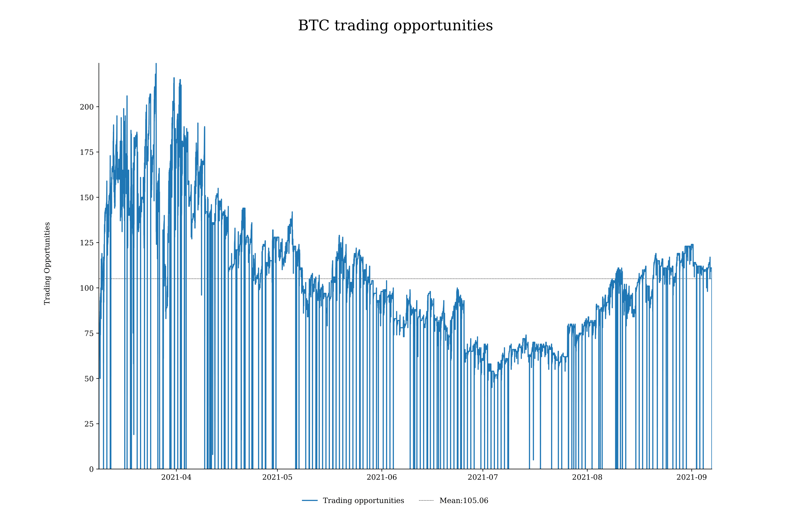
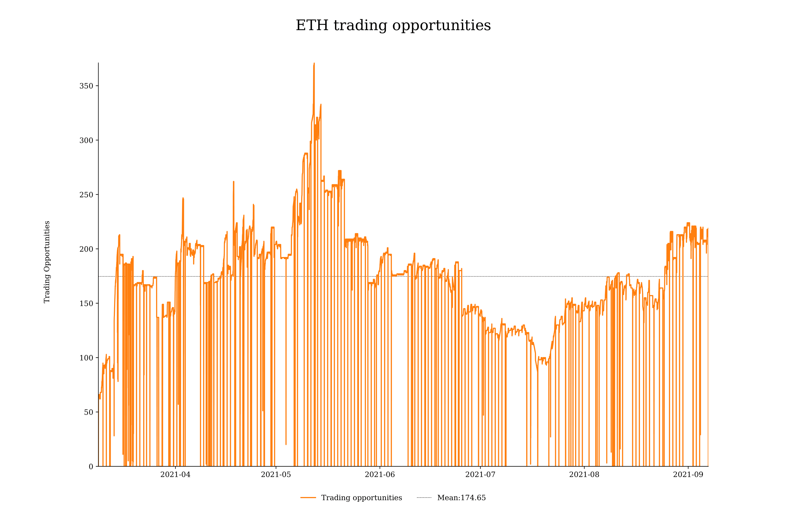
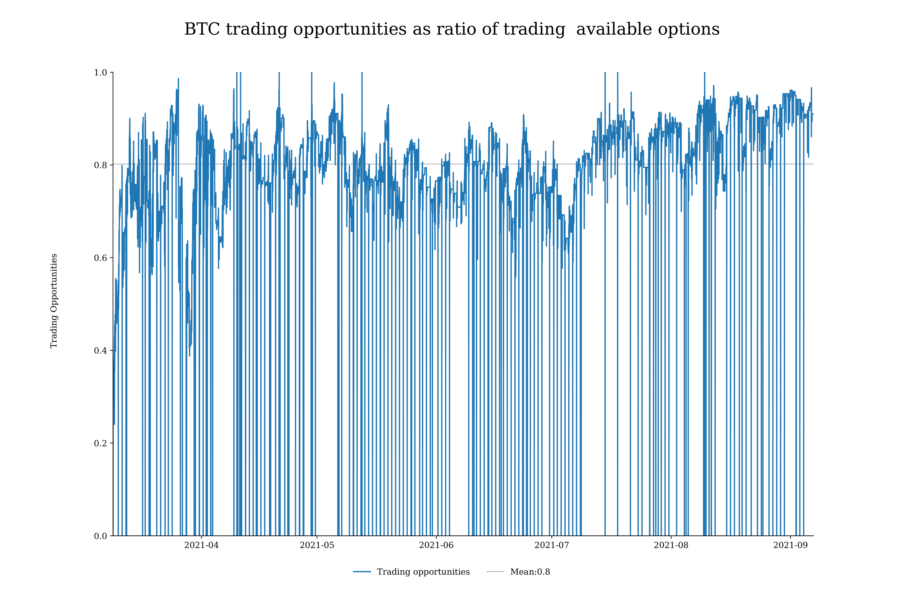
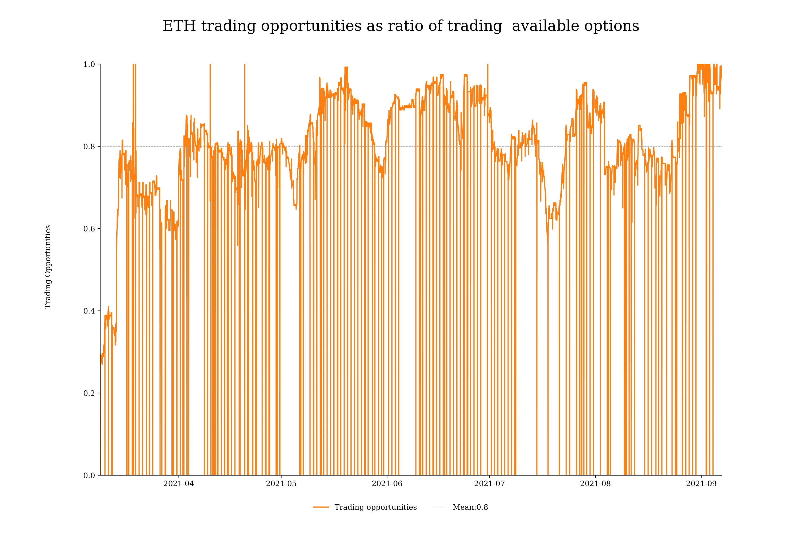
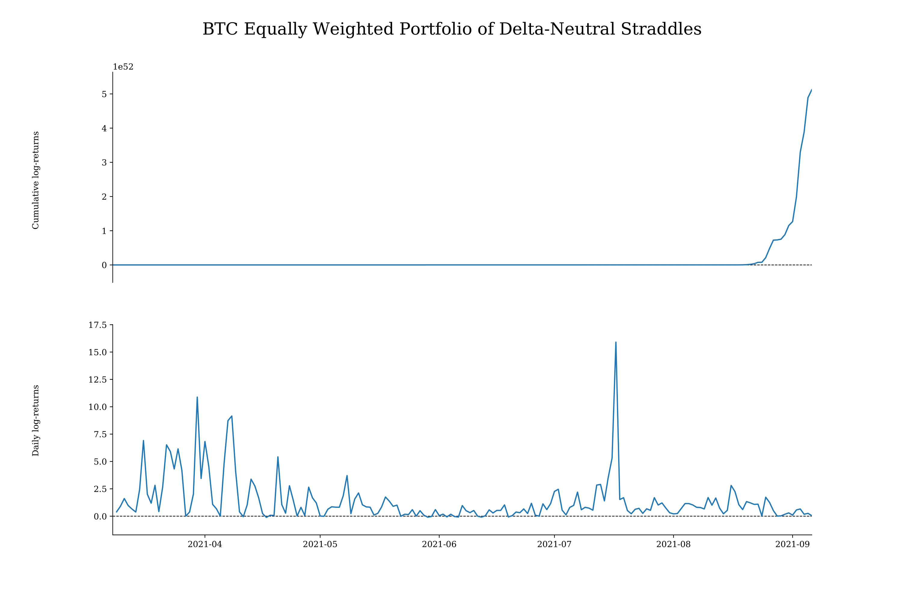
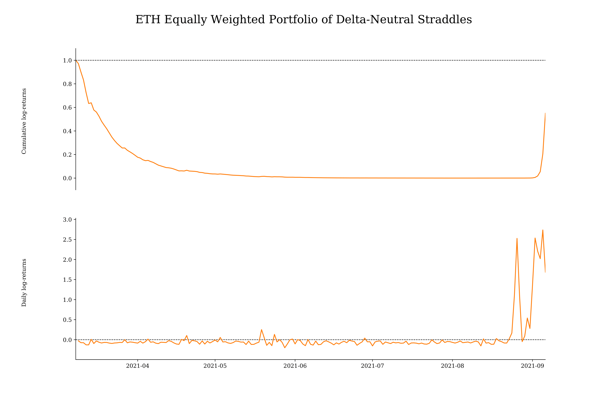

# Delta-Neutral Volatility Trading Report

#### Last Update September 17, 2021 ####
#### Matteo Bottacini, [matteo.bottacini@usi.ch](mailto:matteo.bottacini@usi.ch) ####

## Project description
In this report are show the results obtained for the Delta-Neutral Volatility Trading section.

The codes described are in [`../deliverables/run-delta-hedged-strategy.py`](../deliverables/run-delta-hedged-strategy.py) which is the only script you need to run to perform the analysis. 
The images, tables and data are in [`../reports/`](../reports).

Note: all the images in this GitHub repo are `.png` instead of `.pdf`. 
The reason is to make it easier for GitHub to render the results.

## Table of contents

1. [Load data and data pre-processing](#load-data-and-data-pre-processing)   
2. [Back-test all strategies](#back-test-all-strategies) 
3. [Quantitative strategy performance](#quantitative-strategy-performance)

## Load data and data pre-processing
The first step is to load the data into the working environment and to pre-process them using the function `load_data()` for both `BTC` and `ETH`.

```python
# import modules
from DeltaHedging.src.utils import *

# load data
btc_data = load_data(coin='btc', cwd='DeltaHedging/deliverables')
eth_data = load_data(coin='eth', cwd='DeltaHedging/deliverables')
```

## Back-test all strategies
The second step is to back-test all the strategies for both `BTC` and `ETH`, the function is `all_strategies()`.

```python
# import modules
from DeltaHedging.src.utils import *
from DeltaHedging.src.variables import *

# evaluate all strategies performance
btc_all_strategies = all_strategies(lag=lag, coin_df=btc_data, quantile_iv=quantile_iv, coin='BTC',
                                    fee=fee, margin=margin)
eth_all_strategies = all_strategies(lag=lag, coin_df=eth_data, quantile_iv=quantile_iv, coin='ETH',
                                    fee=fee, margin=margin)
```

This function will return 2 `.parquet` files one containing the time-series with the portoflios' values and the other one with the trading positions for each delta-neutral straddle.

The `BTC` data are:
* Portfolios value: [df_final.paruqet](data/BTC/df_final.parquet).
* Portfolios trading positions: [df_final_position.parquet](data/BTC/df_final_position.parquet).

The `ETH` data are:
* Portfolios value: [df_final.paruqet](data/ETH/df_final.parquet).
* Portfolios trading positions: [df_final_position.parquet](data/ETH/df_final_position.parquet).

## Quantitative strategy performance
The third step is to evaluate the performance of the equally weighted portoflios of delta-neutral long and short straddles.
The function is `strategy_performance()` and it is done for both `BTC` and `ETH`.

```python
# import modules
from DeltaHedging.src.utils import *
from DeltaHedging.src.variables import *

# quantitative strategy performance
btc_strategy = strategy_performance(coin='BTC', transaction_cost=transaction_cost)
eth_strategy = strategy_performance(coin='ETH', transaction_cost=transaction_cost)
```

Then, this function will first return a plot with the number of instrument in a portfolio every 5 minutes.




Then, the number of long and short delta-neutral straddles entered in comparison to the total number of straddles available.




Then, it returns a table with a summary of the descriptive statistics for both `BTC` and `ETH`:
* BTC: [summary_performance_all.csv](data/BTC/summary_performance_all.csv)
* ETH: [summary_performance_all.csv](data/ETH/summary_performance_all.csv)

And the summary of the daily log-returns of the quant-portfolios:
* BTC: [summary_final_ret.csv](data/BTC/summary_final_ret.csv)
* ETH: [summary_final_ret.csv](data/ETH/summary_final_ret.csv)

## Visualize strategy performance
Finally, we visualize the strategy performance using the function `plot_strategy()`:

```python
# import modules
from DeltaHedging.src.utils import *

# plot final results
plot_strategy(coin='BTC', ret=btc_strategy[0], cum_ret=btc_strategy[1])
plot_strategy(coin='ETH', ret=eth_strategy[0], cum_ret=eth_strategy[1])

```

And the results are:


