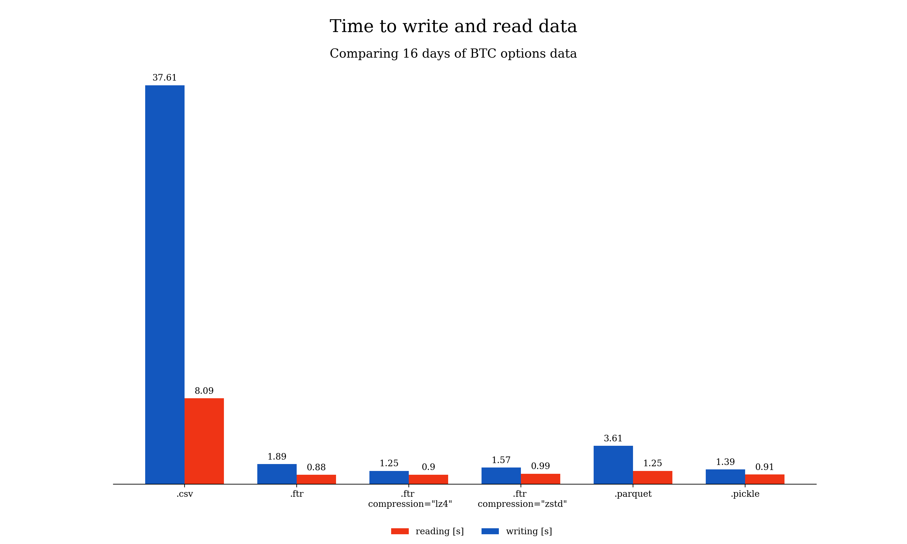
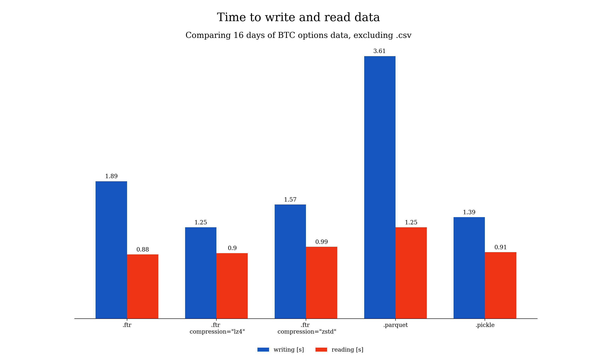
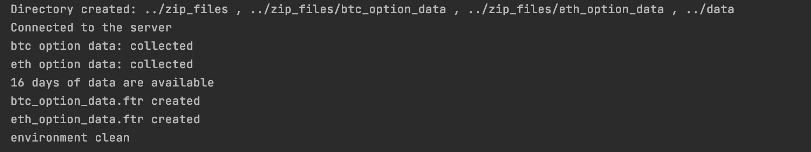

# Walk through the code

#### Last Update March 25, 2021 ####
#### Matteo Bottacini, [matteo.bottacini@usi.ch](mailto:matteo.bottacini@usi.ch) ####

## Project description
In this report I explain how to pull the option data stored in the Remote Linux Ubuntu server with the use of `Python3`.

The codes described are [`../src/credentials.py`](../src/credentials.py), [`../src/utils.py`](../src/utils.py) and [`../deliverables/get-server-data.py`](../deliverables/get-server-data.py).

## Table of contents

1. [Create the Environment: directories and sub-directories](#create-the-environment-directories-and-sub-directories)
2. [User credentials to SSH into the remote server](#user-credentials-to-ssh-into-the-remote-server)
3. [SSH connect into remote server and pull data](#ssh-connect-into-remote-server-and-pull-data) 
4. [Feather the data and clean the environment](#feather-the-data-and-clean-the-environment)
5. [Get remote server data](#get-remote-server-data)
6. [Supported versions](#supported-versions)
9. [References](#references)

## Create the Environment: directories and sub-directories
The first step is to create all the directories and sub-directories needed to store the data.

In specific, the directories and sub-directories to be made are: `../zip_files`, `../zip_files/btc_option_data`, `../zip_files/eth_option_data`, `../data`.

In [`../src/utils.py`](../src/utils.py) the function `create_env()` performs these tasks:

```python
# import modules
import os

# create the directories and sub-directories needed to get data
def create_env(local_folder):
    """

    :return: create directory and subdirectories needed
    """
    source_path = os.path.abspath(os.getcwd())

    # create /zip_files
    destination_path = source_path.replace(local_folder, 'zip_files')
    if not os.path.exists(destination_path):
        os.mkdir(destination_path)

    # create sub-directory: ../zip_files/btc_option_data
    sub_directory = destination_path + '/btc_option_data'
    if not os.path.exists(sub_directory):
        os.mkdir(sub_directory)

    # create sub-directory: ../zip_files/eth_option_data
    sub_directory = destination_path + '/eth_option_data'
    if not os.path.exists(sub_directory):
        os.mkdir(sub_directory)

    # create /data
    destination_path = destination_path.replace('zip_files', 'data')
    if not os.path.exists(destination_path):
        os.mkdir(destination_path)

    return print('Directory created: ../zip_files , ../zip_files/btc_option_data , ../zip_files/eth_option_data , '
                 '../data')
```


So that the folder structure becomes the following:

~~~~
    ../GetServerData/
        zip_files/
            btc_option_data/
            eth_option_data/
        data/
        deliverables/
            get-server-data.py
        src/
            utils.py
            credentials.py
        reports/
            walk-thorugh-the-code.md
            images/
~~~~

## User credentials to SSH into the remote server
The second step is to write the user credentials to SSH into the remote Ubuntu server.
The information needed are:
* host
* port
* username
* password

These variables have to be changed in [`../src/credentials.py`](../src/credentials.py):

```python
# complete with your credentials
host = "host"
port = 22
username = "username"
password = "****"
```

## SSH connect into remote server and pull data
Pull option data from the remote server is a two-step process:
1. ssh into the server.
2. securely transfer the zipped files between the remote host and the local host using the Secure Copy Protocol (SCP).

In [`../src/utils.py`](../src/utils.py) the function `ssh_remote_server()` performs these tasks.

```python
# import modules
import os
import paramiko
from scp import SCPClient


# ssh connect into remote server
def ssh_remote_server(host, port, username, password, local_folder):

    # SSH into the server
    ssh = paramiko.SSHClient()
    ssh.set_missing_host_key_policy(paramiko.AutoAddPolicy())
    ssh.connect(hostname=host, port=port, username=username, password=password)
    print('Connected to the server')

    # scp bitcoin option data in ../zip_files/btc_option_data/
    source_path = os.path.abspath(os.getcwd())
    local_path = source_path.replace(local_folder, 'zip_files/btc_option_data/')

    with SCPClient(ssh.get_transport(), sanitize=lambda x: x) as scp:
        scp.get(remote_path='/home/bottama/zip_files/btc_option_data/*.zip',
                local_path=local_path)
    print('btc option data: collected')

    # scp ethereum option data in ../zip_files/eth_option_data/
    local_path = source_path.replace(local_folder, 'zip_files/eth_option_data/')
    with SCPClient(ssh.get_transport(), sanitize=lambda x: x) as scp:
        scp.get(remote_path='/home/bottama/zip_files/eth_option_data/*.zip',
                local_path=local_path)
        print('eth option data: collected')

    # close connection
    scp.close()
```

After this process the new folder structures becomes the following:

~~~~
    ../GetServerData/
        zip_files/
            btc_option_data/
                20210309.zip
                20210310.zip
                ...
            eth_option_data/
                20210309.zip
                20210310.zip
                ...
        data/
        deliverables/
            get-server-data.py
        src/
            utils.py
            credentials.py
        reports/
            walk-thorugh-the-code.md
            images/
~~~~

## Feather the data and clean the environment
The next steps are: 
1. unzip all the files; 
2. append the daily tables into a single table with all the observations;
3. convert the pandas DataFrame into feather files;
4. clean the environment removing useless folders and files.

The process to unzip all the files consists in a loop through the items in the `../zip_files` directory in order to decompress them, extract all the data and store them in `pandas.DataFrame`.

At the end of every iteration, once the data are unzipped the original `.zip` file is deleted and the new `pandas.DataFrame` is converted into a `.ftr` file using `ZSTD` compression method and then moved to its final folder in the `../data/` directory. 

Once the `pandas.DataFrame` is feathered the `../zip_files` directory is removed, and the environment cleaned.

### Feather ZSTD
Feather provides binary columnar serialization for data frames. 
It is designed to make reading and writing data frames efficient, and to make sharing data across data analysis languages easy. 
This initial version comes with bindings for python (written by [Wes McKinney](https://github.com/wesm)) and R (written by [Hadley Wickham](https://github.com/hadley/)).

Feather uses the [Apache Arrow](https://arrow.apache.org) columnar memory specification to represent binary data on disk. 
This makes read and write operations very fast. 
This is particularly important for encoding null/NA values and variable-length types like UTF8 strings.

Feather is a part of the broader Apache Arrow project. Feather defines its own simplified schemas and metadata for on-disk representation.

Feather currently supports the following column types:

* A wide range of numeric types (int8, int16, int32, int64, uint8, uint16, uint32, uint64, float, double).
* Logical/boolean values.
* Dates, times, and timestamps.
* Factors/categorical variables that have fixed set of possible values.
* UTF-8 encoded strings.
* Arbitrary binary data.

All column types support NA/null values.

The Feather ZSTD file format has been chosen after having compared its performance against `.csv` (the baseline model), `.ftr`, `.ftr LZ4`, `.parquet` and `.pickle`.
All the models wrote and read the same `pandas.DataFrame` consisting in 16 days of BTC option data.
Lastly, the PC used to perform the task had the following characteristics:
* Processor: 2.3 GHz Quad-Core Intel Core i5
* Memory: 8 GB 2133 MHz LPDDR3
* Graphics: Intel Iris Plus Graphics 655 1536 MB

The metrics to be compared are:
* `Storage`: the size of the file (in Mb) with the `pandas.DataFrame`.
* `Write time`: time required to write the `pandas.DataFrame` onto the disk.
* `Read time`: time required to read the new file.

#### Storage 
The file size benefits of compression in Feather V2 are quite good, though Parquet is smaller on disk, due in part to its internal use of dictionary and run-length encoding. 
The Parquet file is smaller than the compressed Feather V2, the CSV and the Pickle ones. 

Summarizing: either Parquet and Feathers store the same data saving more than 50% space than Pickle. 


#### Read and Write time
Parquet is ranked 5th to read into an Arrow Table and both Feather and Pickle are faster. 
Feather with compression is even faster to read. 
This is partly because the files are much smaller on disk.

The arrow package’s Feather reader (V2) faster than the V1 implementation in the feather package. 
Pickle, Feather V1, and Feather V2 are all comparably fast. 
Reading .csv is much slower, literally off the chart here: the uncompressed file took 8.09 seconds to read. 



For these reasons, to better visualize the data here is proposed the same analysis excluding the baseline `.csv` model.



On the write side, we see that compressed Feather files can also be faster to write than uncompressed files, and also faster than writing to Parquet. 
Pickle and Feathers are all comparably fast.

### Feather V2 attributes 
Feather V2 has some attributes that make it attractive:
* Accessible by any Arrow implementation. R and Python use the Arrow C++ library internally, which is a well-supported reference implementation. 
* Generally faster read and write performance when used with solid state drives, due to simpler compression scheme. 
* Internal structure supports random access and slicing from the middle. Meaning that it is possible to read a large file chunk by chunk without having to pull the whole thing into memory.
* Complete support for all Arrow data types. 


In [`../src/utils.py`](../src/utils.py) the function `clean_data_and_env()` performs these tasks.

```python
# import modules
import os
import pandas as pd
import shutil
import zipfile
import pyarrow.feather as feather


# unzip & convert data to a pickle file and clean the environment
def clean_data_and_env(local_folder):

    # source path
    source_path = os.path.abspath(os.getcwd())

    # unzip bitcoin data
    dir_name = source_path.replace(local_folder, 'zip_files/btc_option_data')
    extension = ".zip"

    # change directory from working dir to dir with files
    os.chdir(dir_name)

    btc_data_df = pd.DataFrame()
    flag = False

    # loop through items in dir
    print(str(len(os.listdir(dir_name))) + ' days of data are available')
    for item in os.listdir(dir_name):

        # check for ".zip" extension
        if item.endswith(extension):

            # get full path of files
            file_name = os.path.abspath(item)

            # create zipfile object
            zip_ref = zipfile.ZipFile(file_name)

            # extract file to dir
            zip_ref.extractall(dir_name)

            # convert to pandas DataFrame
            local_path = dir_name + '/csv_files/btc_option_data.csv'
            df = pd.read_csv(local_path, header=0)

            if not flag:
                btc_data_df = df
                flag = True
            else:
                btc_data_df = pd.concat([btc_data_df, df])

            # close file
            zip_ref.close()

            # delete zipped file
            os.remove(file_name)

    # convert pandas to feather ZSTD file
    local_path = source_path.replace(local_folder, 'data/btc_option_data.ftr')
    feather.write_feather(btc_data_df, local_path, compression='zstd')
    print('btc_option_data.ftr created')

    # unzip ethereum data
    dir_name = source_path.replace(local_folder, 'zip_files/eth_option_data')
    extension = ".zip"

    # change directory from working dir to dir with files
    os.chdir(dir_name)

    eth_data_df = pd.DataFrame()
    flag = False

    # loop through items in dir
    for item in os.listdir(dir_name):
        if item.endswith(extension):
            file_name = os.path.abspath(item)
            zip_ref = zipfile.ZipFile(file_name)
            zip_ref.extractall(dir_name)

            local_path = dir_name + '/csv_files/eth_option_data.csv'
            df = pd.read_csv(local_path, header=0)
            if not flag:
                eth_data_df = df
                flag = True
            else:
                eth_data_df = pd.concat([eth_data_df, df])

            zip_ref.close()
            os.remove(file_name)

    # convert pandas to feather ZSTD file
    local_path = source_path.replace(local_folder, 'data/eth_option_data.ftr')
    feather.write_feather(eth_data_df, local_path, compression='zstd')
    print('eth_option_data.ftr created')

    # clean the environment: remove zip_files directory
    local_path = source_path.replace(local_folder, 'zip_files')
    shutil.rmtree(local_path, ignore_errors=True)
    print('environment clean')
```

## Get remote server data
The last step consists in get remote server data locally.

In [`../src/utils.py`](../src/utils.py) the function `clean_data_and_env()` performs these tasks.

```python
# get data with a unique function
def get_server_data(host, port, username, password, local_folder):

    # create environment
    create_env(local_folder)

    # ssh remote server
    ssh_remote_server(host, port, username, password, local_folder)

    # get data and clean the environment
    clean_data_and_env(local_folder)
```

Then, the code to run is [`../deliverables/get-server-data.py`](../deliverables/get-server-data.py):

```python
# import modules
from GetServerData.src.credentials import *
from GetServerData.src.utils import *

# pull option data from the remote ubuntu server
get_server_data(host, port, username, password, 'deliverables')
```

The output is:



The final folder structures becomes:

~~~~
    ../GetServerData/
        data/
            btc_option_data.ftr
            eth_option_data.ftr
        deliverables/
            get-server-data.py
        src/
            utils.py
            credentials.py
        reports/
            walk-thorugh-the-code.md
            images/
~~~~

## Supported versions

This setup script has been tested against Python 3.8.5.


## References

[Pickle files](https://docs.python.org/3/library/pickle.html)

[Feather files](https://github.com/wesm/feather)

[Apache Parquet](https://parquet.apache.org)
