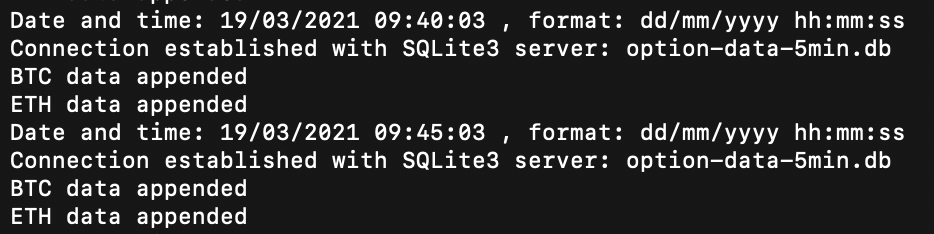
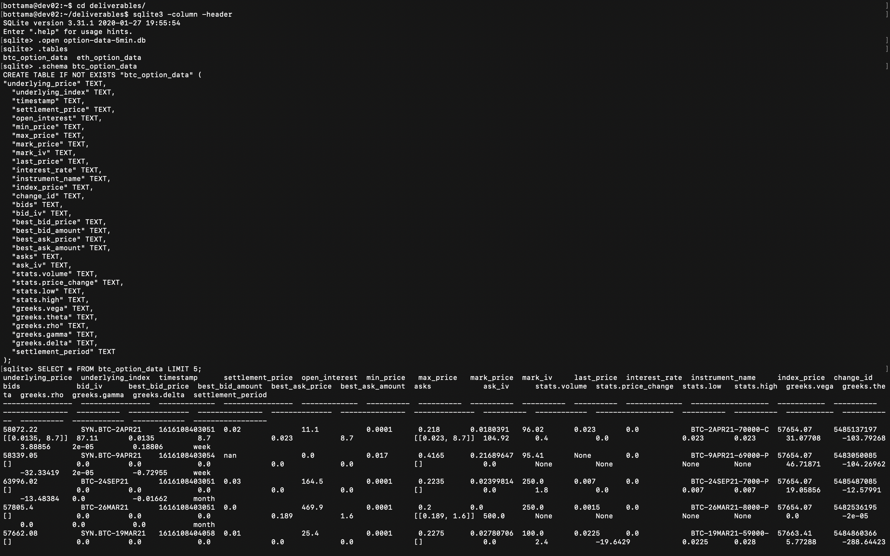

# Bash Setup script for Ubuntu servers

#### Last Update March 19, 2021 ####
#### Matteo Bottacini, [matteo.bottacini@usi.ch](mailto:matteo.bottacini@usi.ch) ####

This is a setup script to automate the setup and provisioning of Ubuntu servers. 


## Table of contents

1. [Add SQLite3, Python3, pip and cron to the server](#add-sqlite3-python3-pip-and-cron-to-the-server)
2. [Install Python modules](#install-python-modules)
3. [Create directories and sub-directories](#create-directories-and-sub-directories) 
4. [Add the Python script](#add-the-python-script)
5. [Add the SHELL script](#add-the-shell-script)
6. [Cron-job setup](#cron-job-setup)
7. [Access log file for traceback](#access-log-file-for-traceback)
8. [Access the database](#access-the-database)
9. [Data management and stroage impact](#data-management-and-storage-impact)
10. [References](#references)
11. [Supported versions](#supported-versions)


## Add SQLite3, Python3, pip and cron to the server
SSH into your server and install SQLite3, Python3, pip and cron if not installed:
```bash
sudo apt-get update
sudo apt install sqlite3
sudo apt install python3
sudo apt-get install -y python3-pip
sudo apt-get install cron
```

## Install Python modules:
```bash
pip3 install pandas
pip3 install tqdm
pip3 install sqlite3
```

## Create directories and sub-directories 
Create directories in the remote server to then stores data:
`../src`, `../deliverables`, `../logs`, `../csv_files`, `../zip_files`
```bash
mkdir src
mkdir deliverables
mkdir logs
mkdir csv_files
mkdir zip_files
```

Create sub-directories: `../zip_files/btc_option_data` and `../zip_files/eth_option_data` to store zipped files.
```bash
cd zip_files/
mkdir btc_option_data
mkdir eth_option_data
cd # back home
```

## Add the Python script
Add [`../src/option-data-download.py`](../src/option-data-download.py) Python script to Ubuntu remote server by copying and pasting it after opening pico.
```bash
cd src
pico option-data-download.py  #copy and paste the source code
```

## Add the SHELL script
Add [`../Server/src/move-files.sh`](../src/move-files.sh) SHELL script to Ubuntu remote server by copying and pasting if after opening pico.
```bash
cd src
pico move-files.sh  #copy and paste the source code
```

## Cron-job setup
Create a cronjob to download and store data.
Access the crontab page and then execute the copy and paste the commands that follows.
```bash
crontab -e
```

Run the python script [`../Server/src/option-data-download.py`](../src/option-data-download.py) every 5 minutes and add `.log` file for traceback in the `../logs` directory.

```bash
# download option data every 5 minutes and store log files
*/5 * * * * python3 "src/option-data-download.py" >> logs/option-data-5min-download-log.log
```

At the end of each day convert the `sqlite3` tables inside `../deliverables/option-data-5min.db` into `.csv` and move them in `../csv_files`.
Note that: the python script takes up to 2 minutes in my server, the last time is run at 23:55:00, then the code needs to be run between 23:58 and 23:59.

```bash
# at the end of each day create a .csv file with daily values:
58 23 * * * sqlite3 -header -csv /home/bottama/deliverables/option-data-5min.db "select * from btc_option_data;" > csv_files/btc_option_data.csv
58 23 * * * sqlite3 -header -csv /home/bottama/deliverables/option-data-5min.db "select * from eth_option_data;" > csv_files/eth_option_data.csv
```

Initialize the database `../deliverables/option-data.db` before midnight so that it is ready for the next day observations:

```bash
# initialize the data base at 23:59
59 23 * * * rm /home/bottama/deliverables/option-data-5min.db
```

Zip the `../csv_files/btc_option_data.csv` and the `../csv_files/eth_option_data.csv` with compression level `9` (default is 6) at the beginning of each day.

```bash
# zip the csv file at 00.05
5 0 * * * zip -9 -r btc_option_data.zip ./csv_files/btc_option_data.csv
5 0 * * * zip -9 -r eth_option_data.zip ./csv_files/eth_option_data.csv
```

Rename the zipped files and move Bitcoin data into `../zip_files/btc_option_data` and Ethereum data into `../zip_files/eth_option_data` using the `SHELL` script [`/src/move-files.sh`](../src/move-files.sh). 
The files are renamed with the date of the day the data was downloaded.

```bash
# move the zipped files to the zip_files folder and rename it with timestamp (YYYYMMDD) at 00.15
15 00 * * * sh /home/bottama/src/move-files.sh
```

Remove the `.csv` files at the beginning of each day.
```bash
# remove the csv files at 00.30
30 0 * * * rm /home/bottama/csv_files/btc_option_data.csv
30 0 * * * rm /home/bottama/csv_files/eth_option_data.csv
```

Finally quit the `crontab` page by digit `^X` and save the file.

## Access log file for traceback
Access the `.log` file `../logs/option-data-download-log.log`.

```bash
cat option-data-download-log.log
```

then the output will be similar to this:




## Access the database
Access the `.db` SQLite3 database in  `../deliverables/option-data-5min.db`.
```bash
cd deliverables/

# enter SQLite3
sqlite3 -column -header

# open the database
.open option-data-5min.db

# check the tables inside the database
.tables

# get the schema of the tables
.schema btc_option_data

# visualize the tables
SELECT * FROM btc_option_data LIMIT 5;

# quit SQLIte3
.quit

# back to home directory
cd
```
And the output will be similar to this:



## Data management and storage impact
Data are collected in an SQLite3 database every 5 minutes. The database has 2 tables 32 columns each.
On average at every download are retrieved data for 1000 Options - 500 BTCs and 500 ETHs - consisting in 32k new entries every 5 minutes.

`32k new entries ~ 4.1e+7 KB ~ 0.041 MB`

The schema is then the following:

`~2.5 MB/hour` consisting in `60 MB/day` and `21.6 GB/year`.

Converting the SQLite3 tables into csv files is such that at the end of the day there are two csv files `30 MB` each.

The Zipped process is to reduce the storage impact.
The default compression method of Zip is deflate. 
If the zip utility determines that a file cannot be compressed, it simply stores the file in the archive without compressing it using the store method. 
In most Linux distributions, the `zip` utility also supports the `bzip2` compression method.

To specify a compression method, use the `-Z` option.

The `zip` command allows the user to specify a compression level using a number prefixed with a dash from `0` to `9`. 
The default compression level is `-6`. 
When using `-0`, all files will be stored without compression. 
`-9` will force the `zip` command to use an optimal compression for all files.

The higher the compression level, the more CPU-intensive the zip process is, and it will take more time to complete.

Comparing the `-6` against the `-9` compression level:
* `-6`: compression ratio 27.5% (from 60MB to 16.5MB)
* `-9`: compression ratio 25% (from 60MB to 15MB)

In the end thanks to this procedure using compression `-9` against the default `-6` we are improving the storage space by `10%/day`.

Comparing the `zipped-method` against the `non-zipped-method` we are improving the performance by `75%/day`.
One year of data would consist now in `~5.4 GB` while one-year of non-zipped data would have consisted in `21.6 GB`.

## Supported versions
This setup script has been tested against Ubuntu 20.04.2 LTS (GNU/Linux 5.4.0-56-generic x86_64) and SQLite version 3.31.1.

## References
[Zip process](https://linuxize.com/post/how-to-zip-files-and-directories-in-linux/)
