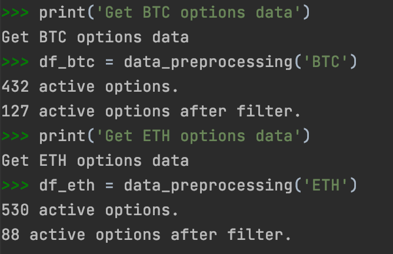
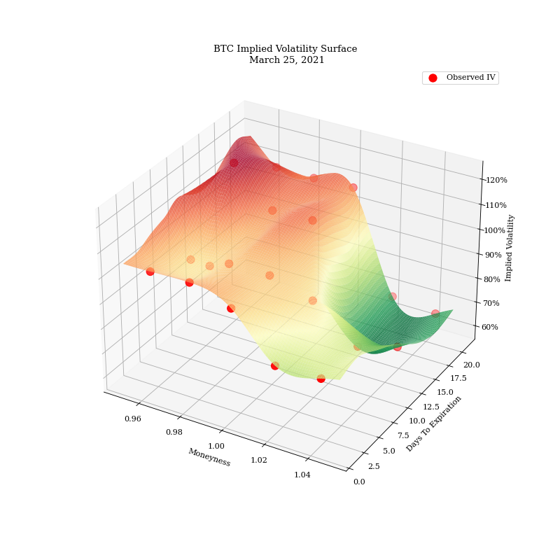
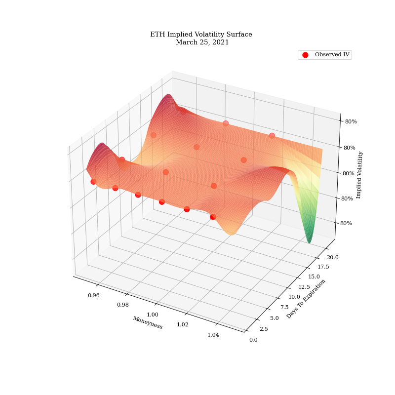
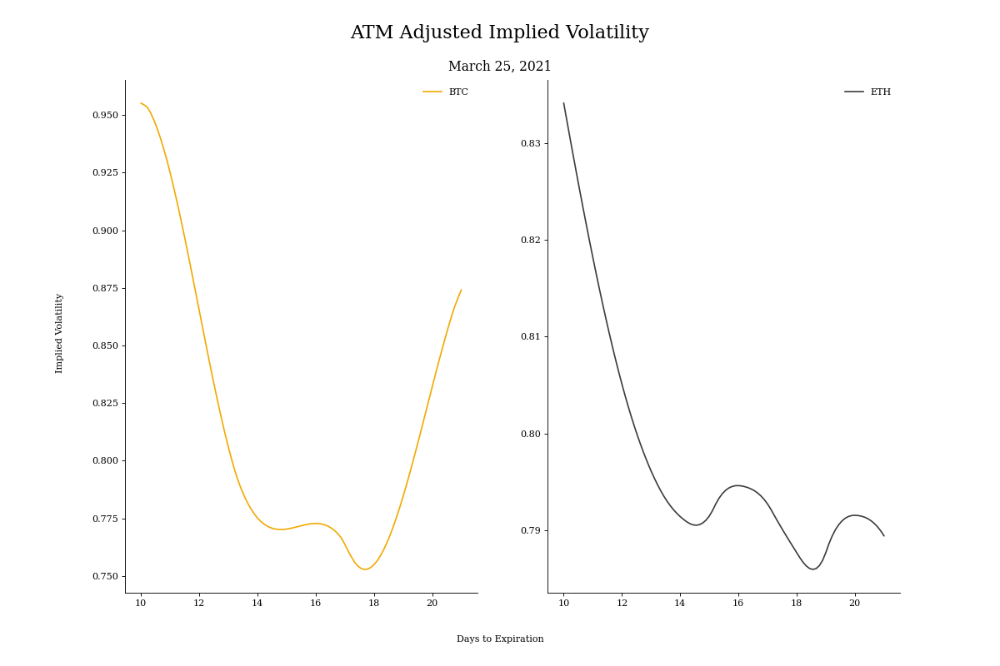
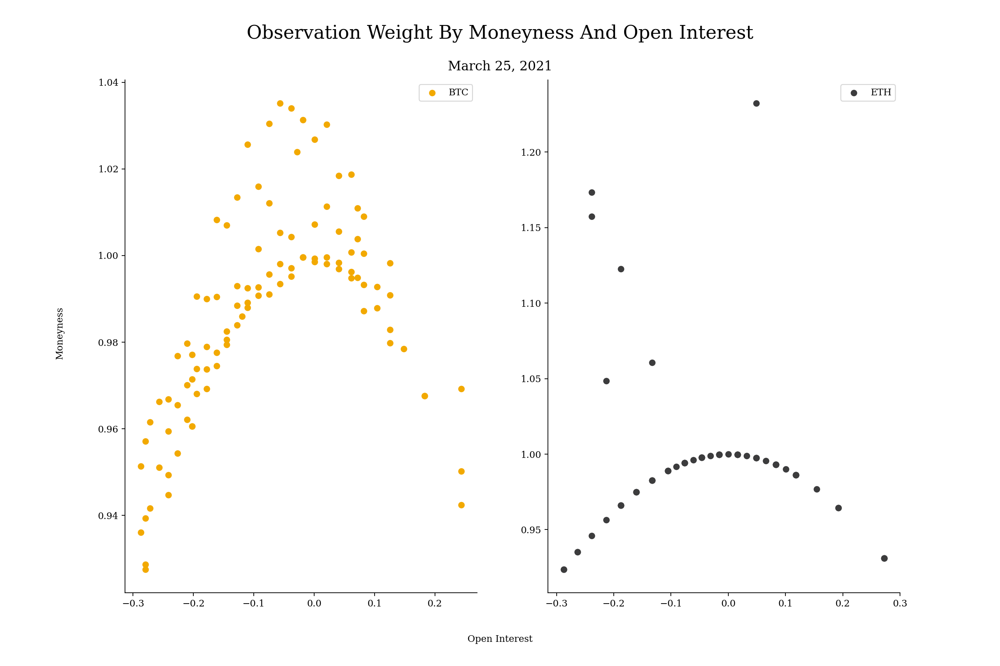
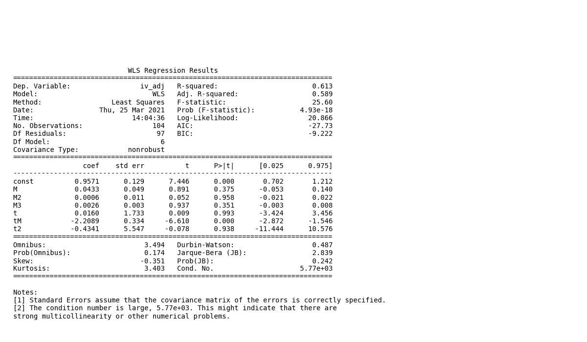
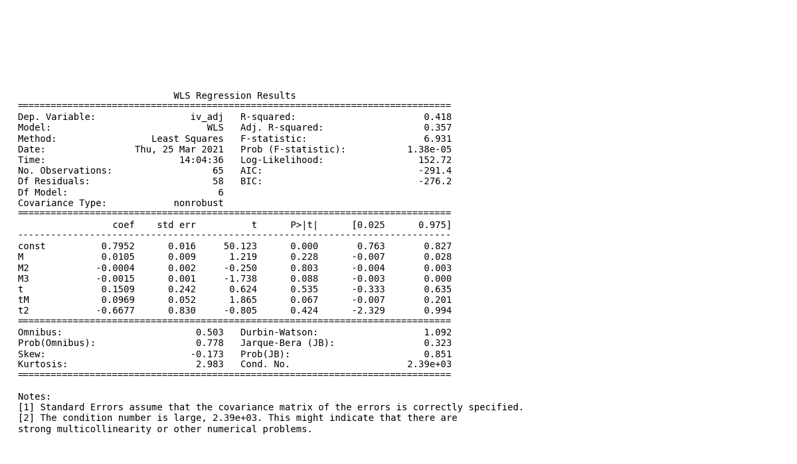
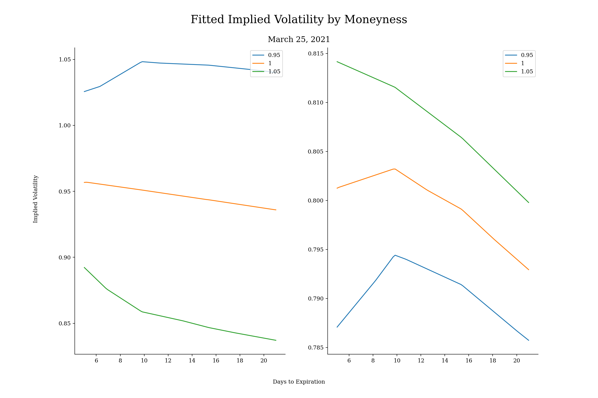

# Report Spot Implied Volatility Analysis

#### Last Update March 23, 2021 ####
#### Matteo Bottacini, [matteo.bottacini@usi.ch](mailto:matteo.bottacini@usi.ch) ####

## Project description
Implied volatility is useful in trading for a number of applications and crypto is no exception. 
The implied volatility surface is a 3D representation of option implied volatility by moneyness and time until expiration. 
A graph of the surface can give a trader detailed volatility information with one image.

The codes described are in [`../deliverables/run-spot-IV-analysis.py`](../deliverables/run-spot-IV-analysis.py).

## Table of contents

1. [Get Data](#get-data)
2. [The Implied Volatility surface: cubic spline interpolation](#the-implied-volatility-surface-cubic-spline-interpolation) 
3. [At-the-Money Adjusted Implied Volatility](#at-the-money-adjusted-implied-volatility)
4. [Simple parametrized surface model](#simple-parametrized-surface-model)
5. [Improvements](#improvements)
6. [Supported versions](#supported-versions)   
6. [References](#references)

## Get data
The first step is to get the current option data both for BTC and ETH.

Deribit’s api provides access to option data traded on the exchange. 

For this run there were:

## The Implied Volatility surface: cubic spline interpolation
With the implied volatility data collected and cleaned it is possible to estimate a complete surface. 
The first method is a spline interpolation if the observed points.

Here is the BTC implied volatility surface one:

 

Here is the ETH implied volatility surface one:

There are isolated options that are causing the surface to make large moves. 
The next section attempts to correct for this.

## At-the-Money Adjusted Implied Volatility

Since not all the observation have current data it is used a crude method to estimate the current implied volatility.

 &sigma;IV = &sigma;IV + &Delta;/&nu; * dP 

The resulting at-the-money (ATM) adjusted implied volatility is the following:

## Simple parametrized surface model

The implied volatility surface is estimated as a linear regression with the features designed to model the skew and time curvature.

 &sigma;t(Mt, &tau;) = 
&beta;0,t + 
&beta;1,tMt + 
&beta;2,tMt2 + 
&beta;3,t&tau; + 
&beta;4,t&tau;Mt + 
&beta;5,t&tau;2 + 
&epsilon;t

Mt = log(Ft/K) * &tau;1/2

There are numbers of variations of this model each with their own benefits and drawbacks.

The implied volatility observations are weighted by moneyness and open interest.
The farther away an option is from the current price, the lower the weight. 
Moreover, options with a higher open interest receive a higher weight.

Then, the Weighted Linear (WLS) regression is setup, and these are the summaries of the models.
Look at the 
R2

* BTC model summary:

* ETH model summary

Then, the parametrized implied volatility surface is the following:

Finally, the fitted implied volatility by moneyness looks smoother than the interpolated version (BTC on the left and ETH on the right):

## Improvements
1. Analyze how the implied volatility and the term structure changes over time.
2. Use better model such as SVI, Heston or Carr. A more advanced model would provide a better estimate of the implied volatility, but with higher complexity and longer processing times.

## Supported versions
This setup script has been tested against Python 3.8.5 and Deribit API v2.0.1.

## References
[Implied Volatility Modelling, Anzi Zhu (2013)](https://core.ac.uk/download/pdf/144147097.pdf)

[SVI model](https://www.semanticscholar.org/paper/A-parsimonious-arbitrage-free-implied-volatility-to-Gatheral/0ba2e344d167fb68264aae3315a040d0c5d98b64)

[Heston model](https://www.semanticscholar.org/paper/A-Closed-Form-Solution-for-Options-with-Stochastic-Heston/4011535b91fd869b8138112739fcad535ac1562c)

[Carr model](https://www.researchgate.net/publication/228291043_A_New_Simple_Approach_for_Constructing_Implied_Volatility_Surfaces)
