# Time Series Derivatives Analysis Report

#### Last Update September 16, 2021 ####
#### Matteo Bottacini, [matteo.bottacini@usi.ch](mailto:matteo.bottacini@usi.ch) ####

## Project description
In this report are show the results obtained for the Time-Series Derivatives Analysis.

The codes described are in [`../deliverables/run-time-series-analysis.py`](../deliverables/run-time-series-analysis.py) which is the only script you need to run to perform the analysis. The images and the tables are in [`../reports/`](../reports/).

Note: all the images in this GitHub repo are `.png` instead of `.pdf`. The reason is to make it easier for GitHub to render the results.

## Table of contents

1. [Main Variables](#main-variables)
2. [Create the Environment: directories and sub-directories](#create-the-environment-directories-and-sub-directories)
3. [Load data and data pre-processing](#load-data-and-data-pre-processing)   
4. [Underlying analytics](#underlying-analytics) 
5. [Implied volatility historical distribution](#implied-volatility-historical-distribution)
6. [Model calibratio](#model-calibration)

## Main variables
The first step is to declare the main variables. Feel free to change this setting.

```python
# main variables
local_folder = 'deliverables'  # folder where this script is run
min_time_interval = 5          # first model to be calibrated
max_time_interval = 1440       # last model to be calibrated 
step = 5                       # step between a model and the following one
atm_skew = 1                   # Skew of an ATM option
itm_skew = 1.75                # Skew of an ITM option, this will be used for modelling the volatility skew 
otm_skew = 0.25                # Skew of an OTM option, this will be used for modelling the volatility skew
```


## Create the Environment: directories and sub-directories
The second step is to create the environment to store the results using the self-function `create_env()`.

```python
# import modules
from TimeSeriesAnalysis.src.utils import *

# create environment
create_env(local_folder=local_folder,
           min_time_interval=min_time_interval, max_time_interval=max_time_interval, step=step)
```

## Load data and data pre-processing
The third step is to load the data into the working environment and to pre-process them using the function `load_data()` for both `BTC` and `ETH`.

```python
# import modules
from TimeSeriesAnalysis.src.utils import *

# load data
btc_data = load_data(coin='btc', cwd='TimeSeriesAnalysis/desliverables')
eth_data = load_data(coin='eth', cwd='TimeSeriesAnalysis/deliverables')
```

## Underlying analytics
The fourth step is to analyze the underlying time-series and dynamics for both `BTC` and `ETH` using the function `underlying_analytics()`.

```python
# import modules
from TimeSeriesAnalysis.src.utils import *

# index price analytics
index = underlying_analytics(local_folder=local_folder, btc_data=btc_data, eth_data=eth_data)
```

Thus, these are the price dynamics for `BTCUSD` and `ETHUSD`:
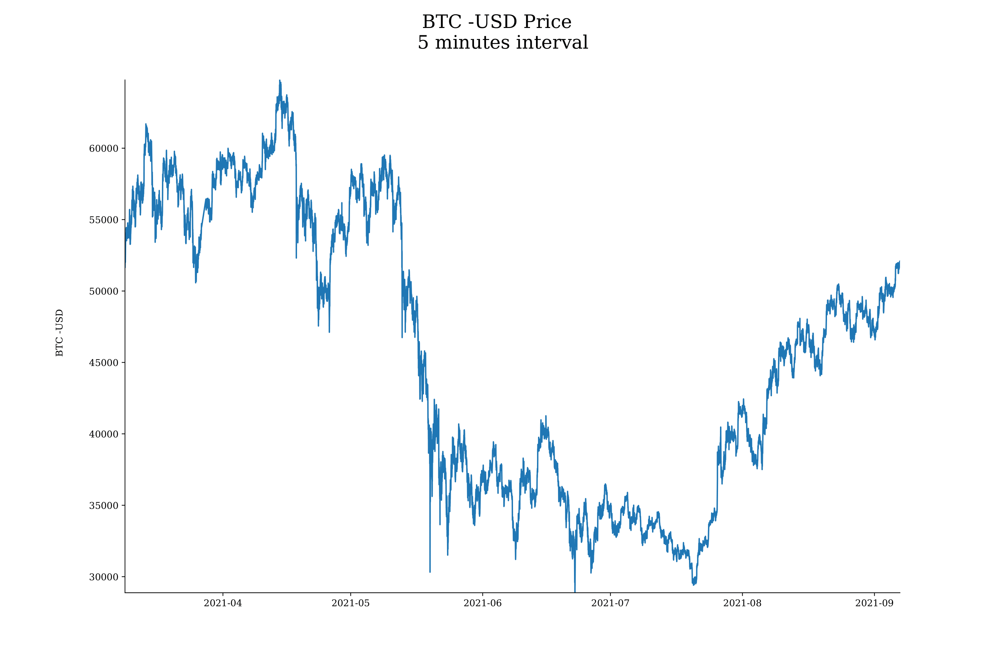
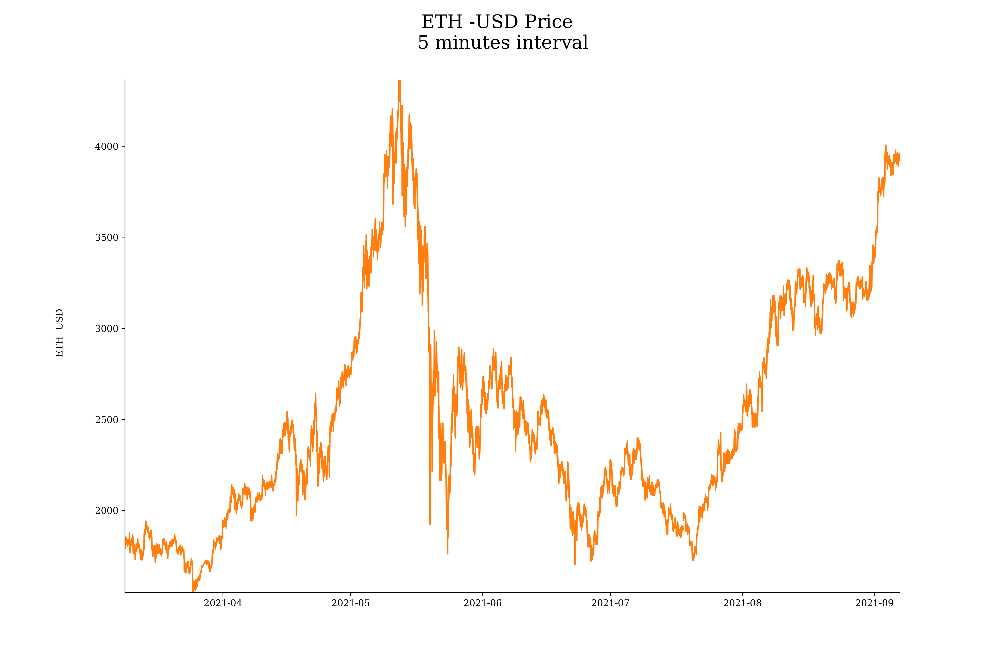

Then, the histogram of the 5-minutes log-returns and Daily log-returns, while the descriptive summary statistics of the returns are in this table: [summary.csv](tables/summary.csv)


Finally, the cumulative returns, 30 rolling correlation and realized volatility:


## Implied Volatility historical distribution
The fifth step is to analyze the historical distribution of the market implied volatiltiy, and it is done by the function `iv_distribution()` for both `BTC` and `ETH`.

```python
# import modules
from TimeSeriesAnalysis.src.utils import *

# iVol distribution analytics
iv_distribution(coin_df=btc_data, coin='BTC', local_folder=local_folder)
iv_distribution(coin_df=eth_data, coin='ETH', local_folder=local_folder)
```

The histograms of the observations are below, while the descriptive summary statistics of the distribution are: [BTC_iv_summary.csv](tables/BTC_iv_summary.csv) and [ETH_iv_summary.csv](tables/ETH_iv_summary.csv).
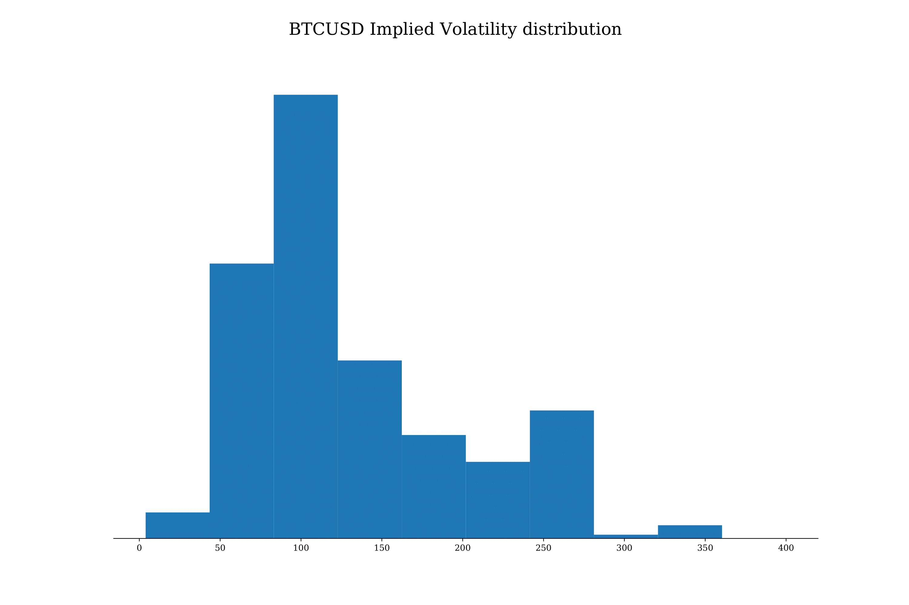
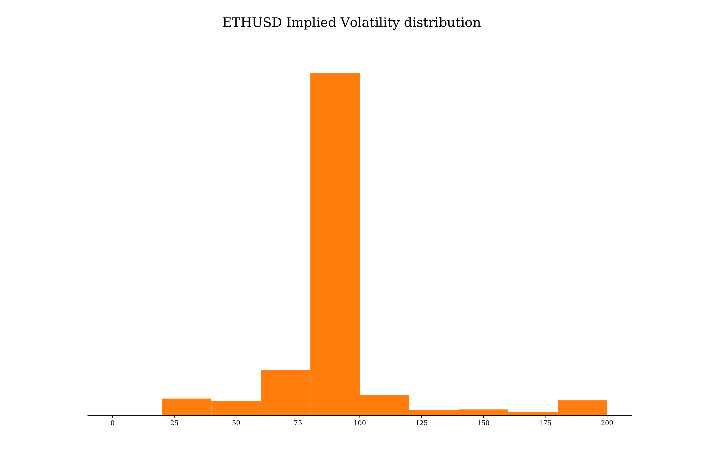

## Model calibration
The last step is to calibrate the model to estimate the implied volatility for both `BTC` and `ETH`. The function used is `model_calibration()`:

```python
# import modules
from TimeSeriesAnalysis.src.utils import *

# model calibration
model_calibration(coin_df=btc_data, min_time_interval=min_time_interval, max_time_interval=max_time_interval,
                  step=step, atm_skew=atm_skew, itm_skew=itm_skew, otm_skew=otm_skew,
                  local_folder='deliverables', coin='BTC')
model_calibration(coin_df=eth_data, min_time_interval=min_time_interval, max_time_interval=max_time_interval,
                  step=step, atm_skew=atm_skew, itm_skew=itm_skew, otm_skew=otm_skew,
                  local_folder='deliverables', coin='ETH')

```

For the purpose of this GitHub only the results from the model calibrated each 720 minutes are shown. 
The `BTC` results for this model are in [BTC/720_min_calibration](BTC/720_min_calibration). 
The `ETH` results for this model are in [ETH/720_min_calibration](ETH/720_min_calibration).

The model parameters' dynamics data are for `BTC`: [BTC/720_min_calibration/data/BTC_parameters.parquet](BTC/720_min_calibration/data/BTC_parameters.parquet)
and for `ETH`: [ETH/720_min_calibration/data/ETH_parameters.parquet](ETH/720_min_calibration/data/ETH_parameters.parquet). 
The summary of the descriptive statistics are for `BTC`: [BTC/720_min_calibration/tables/BTC_parameters.parquet](BTC/720_min_calibration/tables/BTC_parameters.parquet), 
and for `ETH`: [ETH/720_min_calibration/tables/ETH_parameters.parquet](ETH/720_min_calibration/tables/ETH_parameters.parquet). 
Then, the plots are:

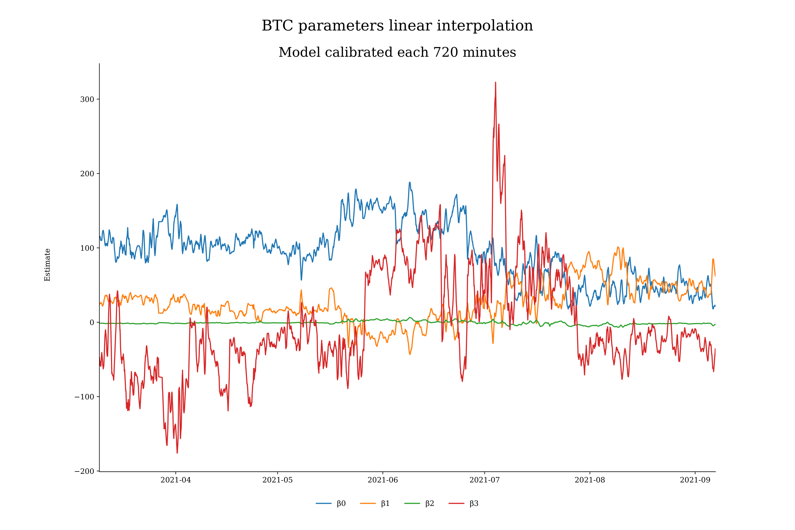
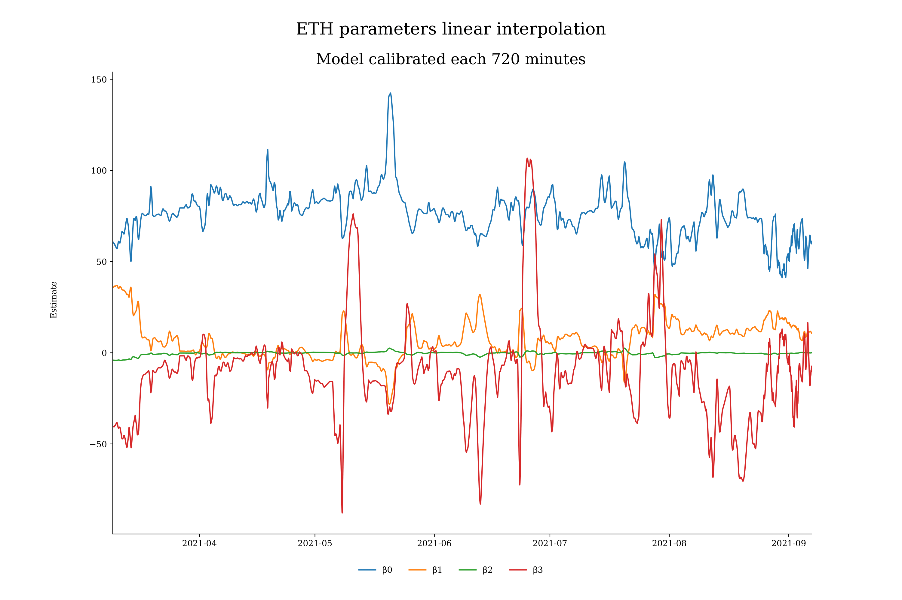

The ATM implied volatility data for `BTC` are: [BTC/720_min_calibration/data/BTC_atm_iv.parquet](BTC/720_min_calibration/data/BTC_atm_iv.parquet)
and for `ETH`: [ETH/720_min_calibration/data/ETH_atm_iv.parquet](ETH/720_min_calibration/data/ETH_atm_iv.parquet).
The summary of the descriptive statistics are for `BTC`: [BTC/720_min_calibration/tables/BTC_atm_iv.parquet](BTC/720_min_calibration/tables/BTC_atm_iv.parquet)
and for `ETH`: [ETH/720_min_calibration/tables/ETH_atm_iv.parquet](ETH/720_min_calibration/tables/ETH_atm_iv.parquet). 
Then, the plots are:

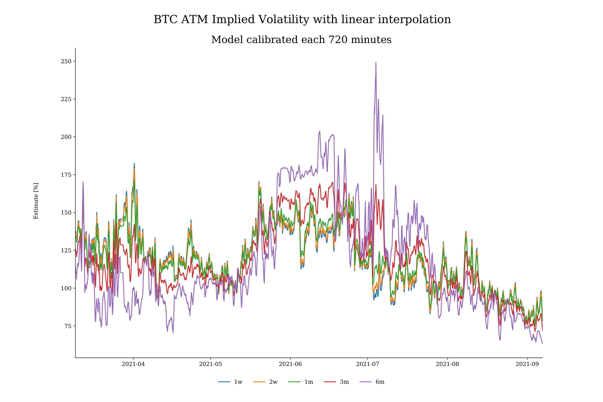
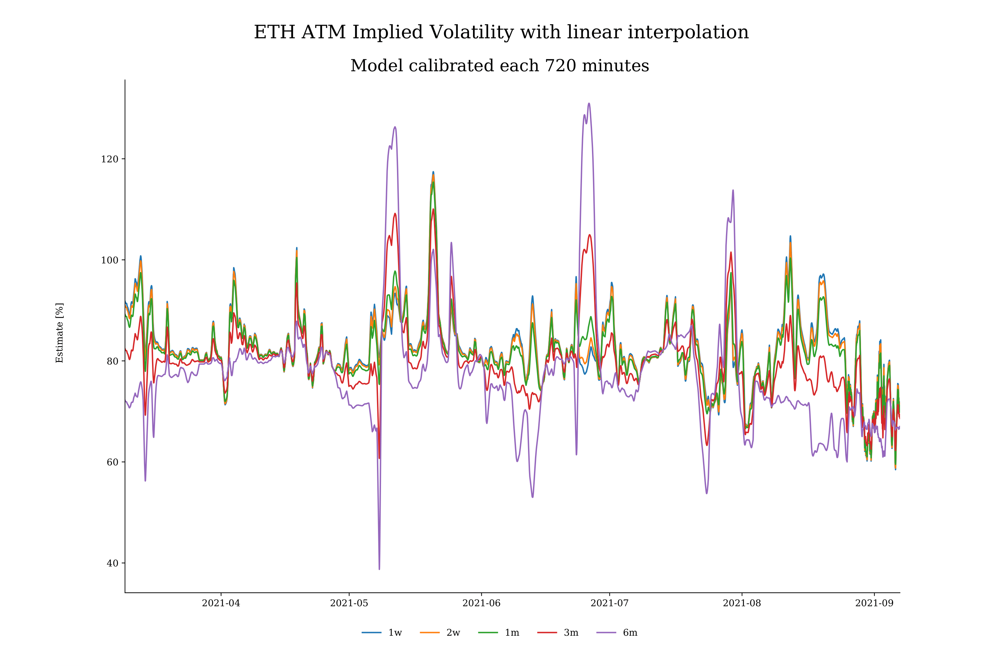

The implied Volatility Term-structure:
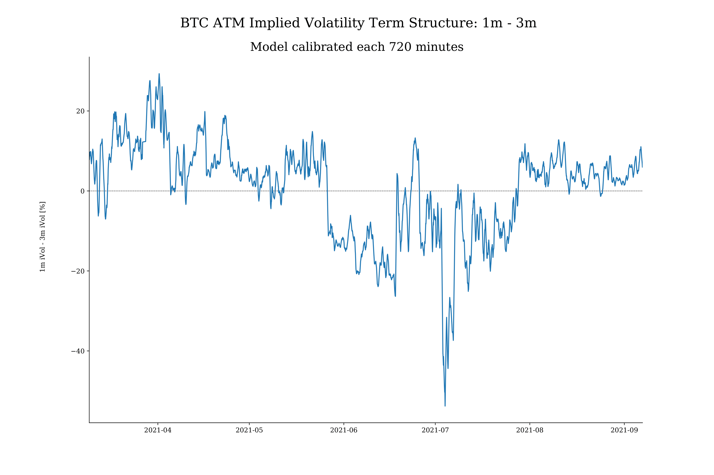


And the Volatility Skew data for `BTC` are: [BTC/720_min_calibration/data/BTC_skew.parquet](BTC/720_min_calibration/data/BTC_skew.parquet)
and for `ETH`: [ETH/720_min_calibration/data/ETH_skew.parquet](ETH/720_min_calibration/data/ETH_skew.parquet).
The summary of the descriptive statistics are for `BTC`:[BTC/720_min_calibration/tables/BTC_skew.parquet](BTC/720_min_calibration/tables/BTC_skew.parquet)
and for `ETH`: [ETH/720_min_calibration/tables/ETH_skew.parquet](ETH/720_min_calibration/tables/ETH_skew.parquet).
Then, the plots are:

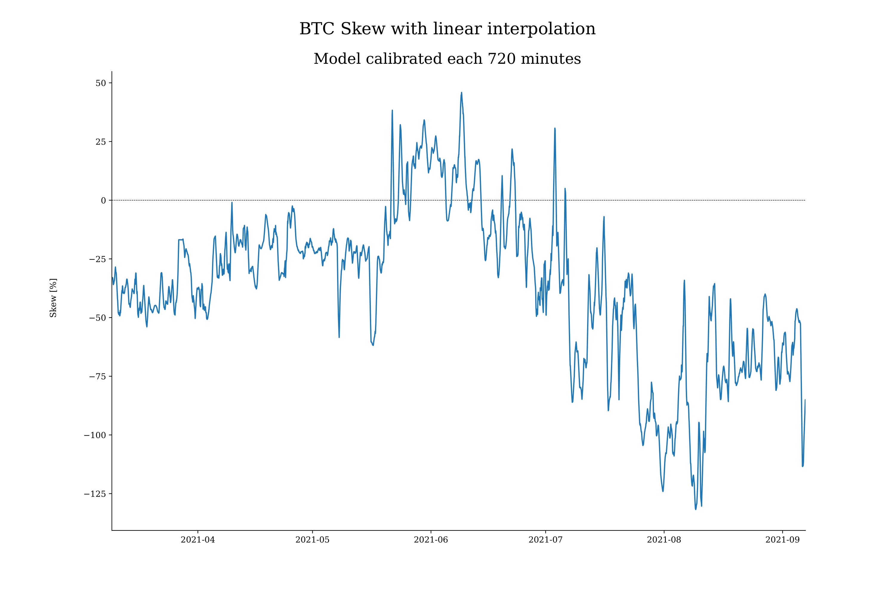
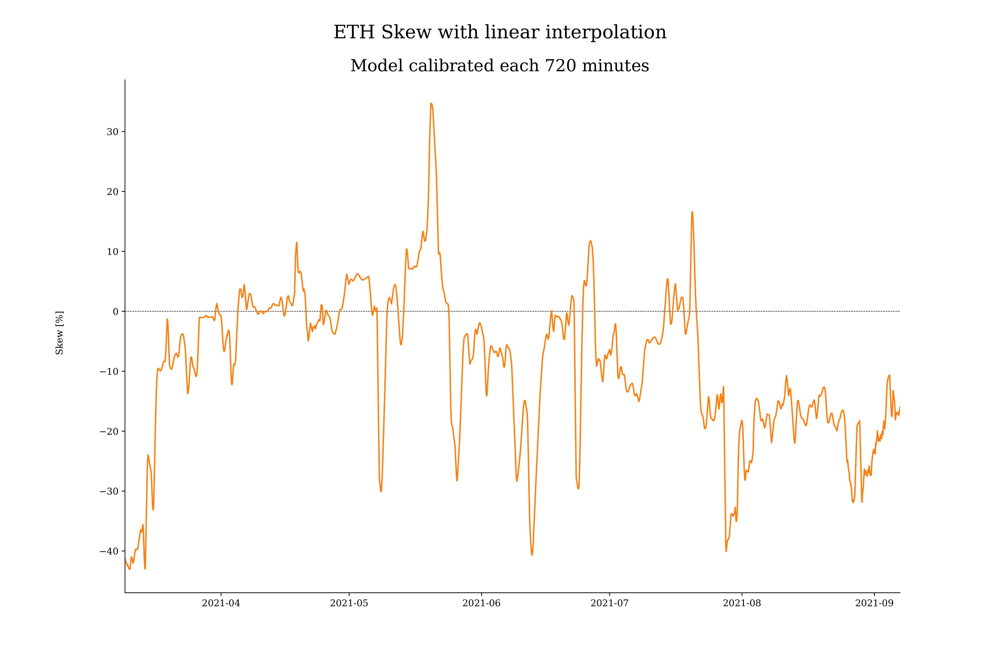

This procedure has been applied to all the different calibrations.
